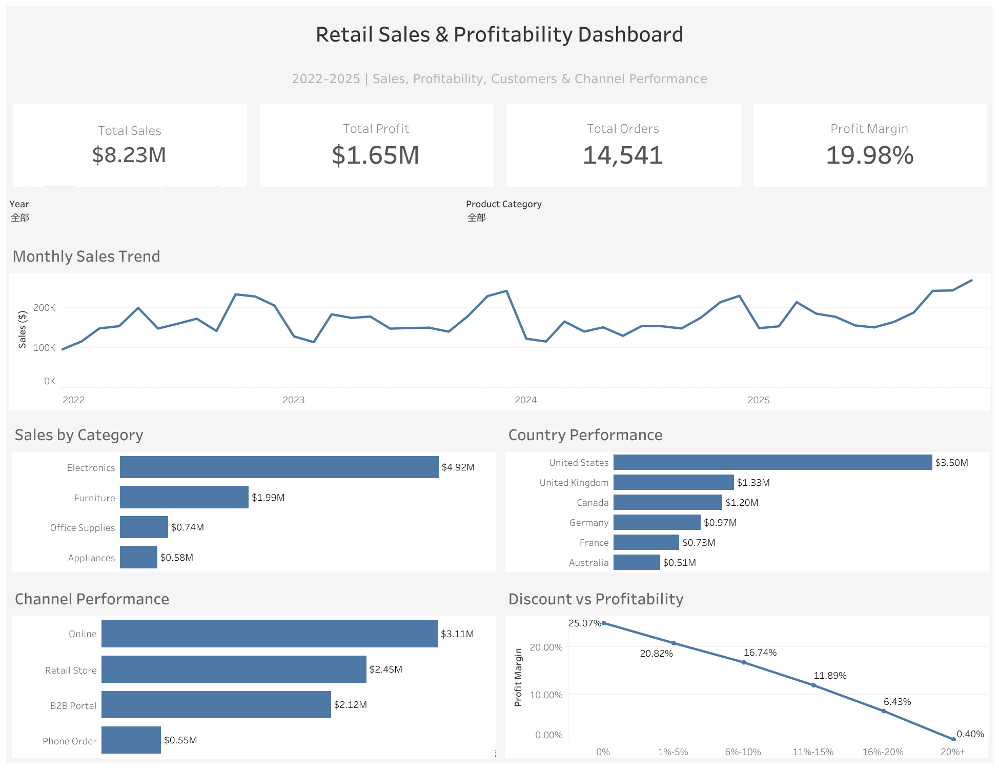

# Retail Sales & Profitability Analysis (2022–2025)

End-to-end data analytics project using Python, Pandas, MySQL, SQL, and Tableau to analyze retail sales performance, profitability, product categories, geographic markets, sales channels, customers, and discount patterns.

## Dashboard Preview



[View Interactive Tableau Dashboard](https://public.tableau.com/views/RetailSalesProfitabilityDashboard_17901183484830/RetailSalesProfitabilityDashboard?:language=en-US&:display_count=n&:origin=viz_share_link)

## Project Overview

This project analyzes retail transaction data from 2022 to 2025 to identify key sales and profitability trends and build an interactive business intelligence dashboard.

The project follows a complete data analytics workflow:

**Raw CSV → Python/Pandas Data Cleaning → MySQL → SQL Analysis → Tableau Dashboard**

The final dataset contains approximately 18,000 retail transactions after data cleaning and validation.

## Tools Used

- Python
- Pandas
- MySQL
- SQL
- Tableau
- GitHub

## Business Questions

This analysis focuses on answering questions such as:

- How have sales changed from 2022 to 2025?
- Which product categories generate the most revenue?
- Which countries contribute the most sales?
- Which sales channels perform best?
- How do discount levels relate to profitability?
- Which areas of the business contribute most to overall performance?

## Tableau Dashboard

The interactive dashboard includes:

- Total Sales
- Total Profit
- Total Orders
- Profit Margin
- Monthly Sales Trend
- Sales by Product Category
- Country Performance
- Channel Performance
- Discount vs Profitability
- Interactive Year and Product Category filters

### Interactive Dashboard

[View the Tableau Dashboard](https://public.tableau.com/views/RetailSalesProfitabilityDashboard_17901183484830/RetailSalesProfitabilityDashboard?:language=en-US&:display_count=n&:origin=viz_share_link)

## Key Insights

- Total sales reached approximately **$8.23M**.
- Total profit reached approximately **$1.65M**.
- The dataset contains **14,541 orders**.
- Overall profit margin was approximately **19.98%**.
- Electronics represented the largest share of total sales.
- The United States generated the highest sales among the analyzed countries.
- Sales performance varied significantly across different sales channels.
- Higher discount levels were associated with lower observed profit margins.

> Note: The relationship between discounts and profitability represents correlation in the observed dataset and does not establish causation.

## Repository Structure

```text
retail-sales-profitability-analysis/
│
├── README.md
├── data/
│   └── Sales_transactions_2022_2025_clean.csv
├── notebooks/
│   └── data_cleaning.ipynb
└── sql/
    └── retail_sales_analysis.sql
